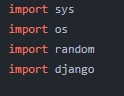
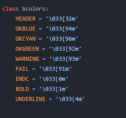
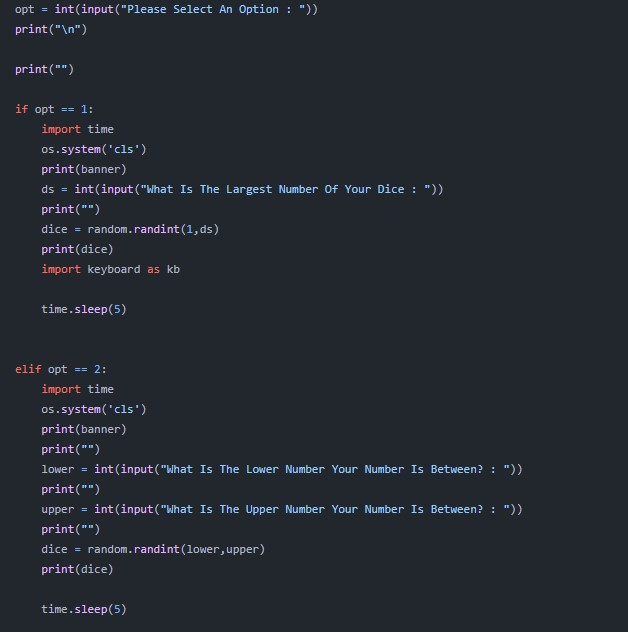

<a href="https://instagram.com/unofficialdxnny">

  

</a>

### Contributing

- <a href="https://github.com/unofficialdxnny/ToolX/fork">Fork the repository</a> 
- Clone your fork git clone https://github.com/your-username/ToolX
- Add changes
- Create a pull request

----

### Code Explanation

I have decided to explain the code from 0 - 100% as I'd like complete beginners to have a go with this project. ;) 

----

### Imports

So proceeding from the first line i have imported some modules i am going to use

### Colour Usage 

The next section is creating the class for the banner and or other text.
 
 
Simply use the `defined` code after the `variable` to use that color 

Each code : color can be viewed <a href="">HERE</a>

### The Menu

Here you will type your tools name and than allign it accordingly

### The Structure

This is a section of the code

Here the user is prompted to type the `number` of the `Tool` they wish to use

If the user chooses `option 1` the program will launch the first tool

All that `elif` means is `but if`.  Putting that definition easier will be , if the user presses 1 do this but if the user presses 2 do this.

### Your Tool

What you need to `ALWAYS` include is the `elif opt == n:` where n is the next number in the code.

For example as of today (21/02/2022) the there are `8` tools 

so the next tool will start off with `elif opt == 9:` and after this it is mandatory you add these right below this line: `os.system('cls')` `print(banner)` `print("")`.
After the last `print("")` statement `import` any `modules` required for that code even if they have already been imported in the other options.

So the `structure` is now going to look like this:

